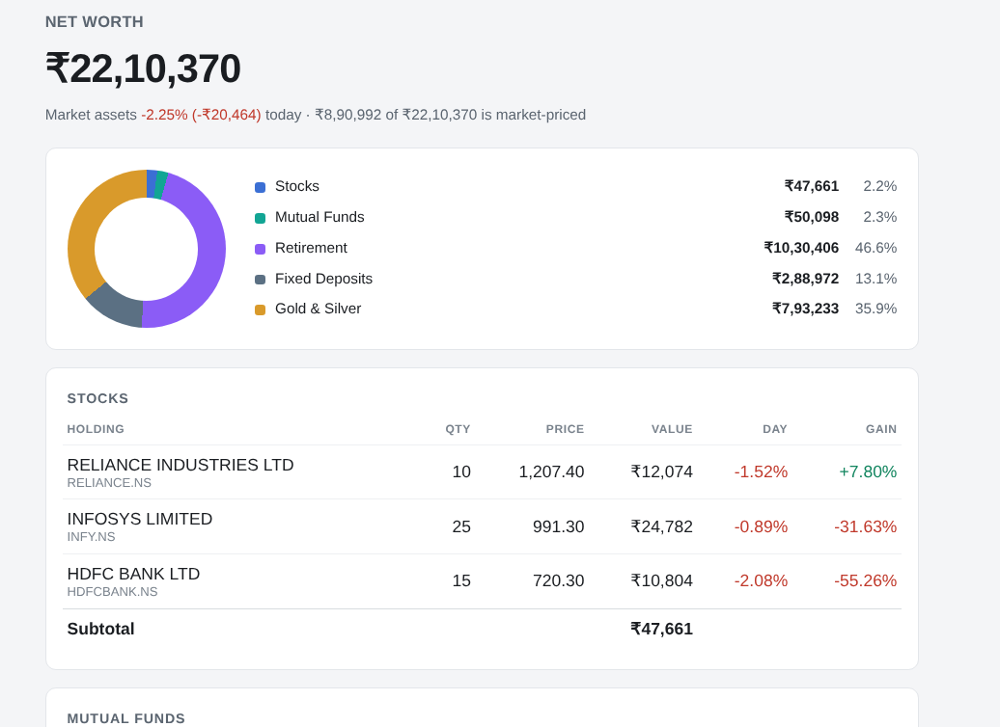

# portfolio_analyzer

A single-page view of an entire Indian investment portfolio — equities, mutual
funds, gold/silver, PPF/EPF/NPS and fixed deposits — with an optional
news-driven recommendation pass that suggests hold/sell actions and buy/short
ideas, each anchored to real price levels.

Runs entirely on your own machine: holdings are read from a local file and never
uploaded. Only public prices and news are fetched.



*Generated page shown with the synthetic example holdings.*

## What it does

- **Aggregates every asset class onto one page** — stocks, funds, metals,
  retirement accounts and FDs — each priced from the right source and shown with
  a subtotal, day change and gain% where a real cost basis exists.
- **Generates news-based recommendations.** `advisor.py` spends a fixed API
  budget on financial news, reads its sentiment, and asks Claude for an
  add/hold/trim/sell call per holding plus buy/short ideas — with buy-below,
  sell-above and stop-loss levels tied to 52-week highs/lows and moving averages.
- **Validates the model's numbers.** Any suggested level on the wrong side of the
  live price (a "buy more below" above today's price) is flagged, not shown.
- **Stays within API limits.** A budget allocator prioritises calls by position
  size, batches the tail, and caches results to disk to respect a 100-request/day
  quota.

## Tech stack

- **Python 3.9**, standard library first (`argparse`, `urllib`, `datetime`,
  `hashlib`, `json`) — third-party deps are just `requests` and `PyYAML`.
- **Anthropic Claude API** (`claude-opus-5`) with structured JSON output
  (`output_config` json_schema) so the recommendation is a validated object, not
  free text.
- **Marketaux** for news and entity-level sentiment; **Yahoo Finance** for live
  prices and one year of history; **mfapi.in** (AMFI mirror) for fund NAVs.
- **Self-contained HTML/CSS** report — no JavaScript framework, no build step.
- **Offline test suites** (`test_portfolio.py`, `test_newsplan.py`,
  `test_advisor.py`) cover all non-model logic with no network or API keys.

> **Design note:** the recommendation flow is a plain pipeline, not a LangChain /
> LangGraph agent. The steps are fixed (plan → fetch → price → one model call) and
> the model makes a single decision, so an agent framework would add dependencies
> without earning them.

## Usage — the portfolio page

```sh
cp holdings.example.yaml holdings.yaml   # then edit in your own numbers
python3 portfolio.py                     # writes portfolio.html
google-chrome portfolio.html             # or: firefox portfolio.html
```

The portfolio page needs no keys and no network beyond public price endpoints;
your holdings never leave the machine. `holdings.yaml` and `portfolio.html` are
gitignored.

Look up a mutual fund's scheme code for the YAML:

```sh
python3 portfolio.py --find "parag parikh flexi"
```

Checks: `python3 test_portfolio.py` (offline, no network).

### What gets priced, and what doesn't

| Asset | Source |
| --- | --- |
| Stocks | Yahoo Finance — NSE `.NS`, BSE `.BO` |
| Mutual funds | `api.mfapi.in` (AMFI mirror) |
| Gold, silver | `GC=F` / `SI=F` × `INR=X` ÷ 31.1035, times your `premium_pct` |
| PPF, EPF | Compounded forward from the balance and date you enter |
| Fixed deposits | Quarterly compounding, frozen at maturity |
| NPS | Balance as entered — NPS Trust's NAV endpoint has no open API |

`premium_pct` is a calibration knob: international spot sits below Indian retail
because of import duty and GST. Set it once so the per-gram rate matches what your
jeweller quotes, then leave it.

Day change is shown for market-priced assets only — a day change on a PPF balance
would be meaningless. Gain% appears only where there's a real cost basis, so PPF,
EPF, NPS and FDs show value alone rather than a made-up number.

## Usage — news-based recommendations

```sh
python3 advisor.py --plan      # show the 30 + 15 API calls, spends nothing
python3 advisor.py             # fetch news, ask Claude, print table + advice.json
```

Needs `.env` (gitignored) with `MARKETAUX_TOKEN=...` and `ANTHROPIC_API_KEY=...`,
plus `pip install anthropic`. Both keys are checked before any quota is spent.

Budgets are flags: `--calls 30 --discovery 15 --per-call 3`. Portfolio calls go
one symbol each, largest position first; spare calls buy extra pages. Discovery
calls page through India-listed news filtered to strong positive/negative
sentiment, and the most extreme names become buy/short candidates. Marketaux
allows 30 requests a minute, so a full run waits about a minute between the two
batches. Results are cached for 6 hours, so a rerun is free.

Price levels (add below, sell above, stop) are anchored to Yahoo 52-week
high/low and 50/200-day averages, and any level on the wrong side of the live
price is flagged rather than shown. Checks: `python3 test_advisor.py`.

**Output is generated from news sentiment. It is not financial advice.**
